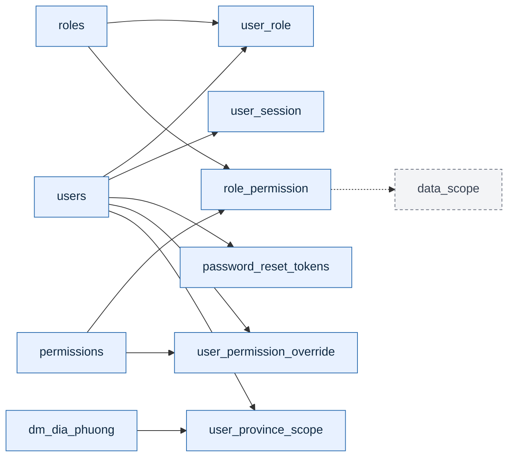

# Database Diagram from `MYHEALTH_ddl.sql`

Sơ đồ dưới đây rút từ script DDL và được gom theo domain để dễ đọc hơn. Các bảng staging/import được giữ ở lớp tổng quan, còn nhóm security được tách riêng để tránh rối.

## 1. Tổng quan domain

```mermaid
flowchart TB
    classDef security fill:#E8F1FF,stroke:#2B6CB0,color:#102A43,stroke-width:1px;
    classDef catalog fill:#E8FFF3,stroke:#2F855A,color:#102A43,stroke-width:1px;
    classDef ops fill:#FFF4E5,stroke:#C05621,color:#102A43,stroke-width:1px;
    classDef external fill:#F3F4F6,stroke:#6B7280,color:#374151,stroke-dasharray: 4 3;

    subgraph SECURITY[Security & Access]
        direction LR
        USERS[users]
        ROLES[roles]
        PERMISSIONS[permissions]
        USER_ROLE[user_role]
        ROLE_PERMISSION[role_permission]
        USER_SESSION[user_session]
        PASSWORD_RESET_TOKENS[password_reset_tokens]
        USER_PERMISSION_OVERRIDE[user_permission_override]
        USER_PROVINCE_SCOPE[user_province_scope]
        DM_DIA_PHUONG[dm_dia_phuong]
        DATA_SCOPE[data_scope<br/>(external lookup)]
    end

    subgraph CATALOG[Service Catalog]
        direction LR
        DM_CHUNG[dm_chung]
        DM_SPDV[dm_spdv]
        DM_GOI_DICHVU[dm_goi_dichvu]
        DM_BSC_DICHVU[dm_bsc_dichvu]
        DM_QUYDOI[dm_quydoi]
        DM_SPDV_CCTK[dm_spdv_cctk]
        DM_SPDV_DONGIA[dm_spdv_dongia]
    end

    subgraph OPS[Deployment & Operations]
        direction LR
        DM_CSYT[dm_csyt]
        DM_CSYT_TRIENKHAI[dm_csyt_trienkhai]
        DM_CSYT_TRIENKHAI_IMP[dm_csyt_trienkhai_imp]
        DM_EHC[dm_ehc]
        DM_CUM_DULIEU[dm_cum_dulieu]
        DM_CUM_DULIEU_SPDV[dm_cum_dulieu_spdv]
        DM_DV_BANHANG[dm_dv_banhang]
        DM_HIS_COGB[dm_his_cogb]
    end

    USERS --> USER_ROLE
    ROLES --> USER_ROLE
    USERS --> USER_SESSION
    USERS --> PASSWORD_RESET_TOKENS

    ROLES --> ROLE_PERMISSION
    PERMISSIONS --> ROLE_PERMISSION
    ROLE_PERMISSION -.-> DATA_SCOPE

    USERS --> USER_PERMISSION_OVERRIDE
    PERMISSIONS --> USER_PERMISSION_OVERRIDE

    USERS --> USER_PROVINCE_SCOPE
    DM_DIA_PHUONG --> USER_PROVINCE_SCOPE

    DM_SPDV --> DM_GOI_DICHVU
    DM_SPDV --> DM_SPDV_DONGIA
    DM_SPDV --> DM_SPDV_CCTK
    DM_CHUNG --> DM_SPDV
    DM_CHUNG --> DM_CUM_DULIEU
    DM_CUM_DULIEU --> DM_CUM_DULIEU_SPDV
    DM_DV_BANHANG --> DM_CSYT_TRIENKHAI
    DM_CHUNG --> DM_CSYT_TRIENKHAI

    style USERS fill:#E8F1FF,stroke:#2B6CB0,color:#102A43
    style ROLES fill:#E8F1FF,stroke:#2B6CB0,color:#102A43
    style PERMISSIONS fill:#E8F1FF,stroke:#2B6CB0,color:#102A43
    style USER_ROLE fill:#E8F1FF,stroke:#2B6CB0,color:#102A43
    style ROLE_PERMISSION fill:#E8F1FF,stroke:#2B6CB0,color:#102A43
    style USER_SESSION fill:#E8F1FF,stroke:#2B6CB0,color:#102A43
    style PASSWORD_RESET_TOKENS fill:#E8F1FF,stroke:#2B6CB0,color:#102A43
    style USER_PERMISSION_OVERRIDE fill:#E8F1FF,stroke:#2B6CB0,color:#102A43
    style USER_PROVINCE_SCOPE fill:#E8F1FF,stroke:#2B6CB0,color:#102A43
    style DM_DIA_PHUONG fill:#E8F1FF,stroke:#2B6CB0,color:#102A43

    style DM_CHUNG fill:#E8FFF3,stroke:#2F855A,color:#102A43
    style DM_SPDV fill:#E8FFF3,stroke:#2F855A,color:#102A43
    style DM_GOI_DICHVU fill:#E8FFF3,stroke:#2F855A,color:#102A43
    style DM_BSC_DICHVU fill:#E8FFF3,stroke:#2F855A,color:#102A43
    style DM_QUYDOI fill:#E8FFF3,stroke:#2F855A,color:#102A43
    style DM_SPDV_CCTK fill:#E8FFF3,stroke:#2F855A,color:#102A43
    style DM_SPDV_DONGIA fill:#E8FFF3,stroke:#2F855A,color:#102A43

    style DM_CSYT fill:#FFF4E5,stroke:#C05621,color:#102A43
    style DM_CSYT_TRIENKHAI fill:#FFF4E5,stroke:#C05621,color:#102A43
    style DM_CSYT_TRIENKHAI_IMP fill:#FFF4E5,stroke:#C05621,color:#102A43
    style DM_EHC fill:#FFF4E5,stroke:#C05621,color:#102A43
    style DM_CUM_DULIEU fill:#FFF4E5,stroke:#C05621,color:#102A43
    style DM_CUM_DULIEU_SPDV fill:#FFF4E5,stroke:#C05621,color:#102A43
    style DM_DV_BANHANG fill:#FFF4E5,stroke:#C05621,color:#102A43
    style DM_HIS_COGB fill:#FFF4E5,stroke:#C05621,color:#102A43

    style DATA_SCOPE fill:#F3F4F6,stroke:#6B7280,color:#374151,stroke-dasharray: 4 3
```

## 2. Security & Access chi tiết



## Ghi chú

- Sơ đồ chỉ vẽ các quan hệ thể hiện rõ trong script, không cố gắng đoán quan hệ nghiệp vụ không có FK.
- `data_scope` được tham chiếu trong FK nhưng không xuất hiện trong đoạn script bạn gửi, nên mình để dưới dạng lookup ngoài.
- Nếu bạn muốn, mình có thể tách tiếp thành 3 sơ đồ riêng: Security, Danh mục, và Nghiệp vụ triển khai để nhìn còn rõ hơn.